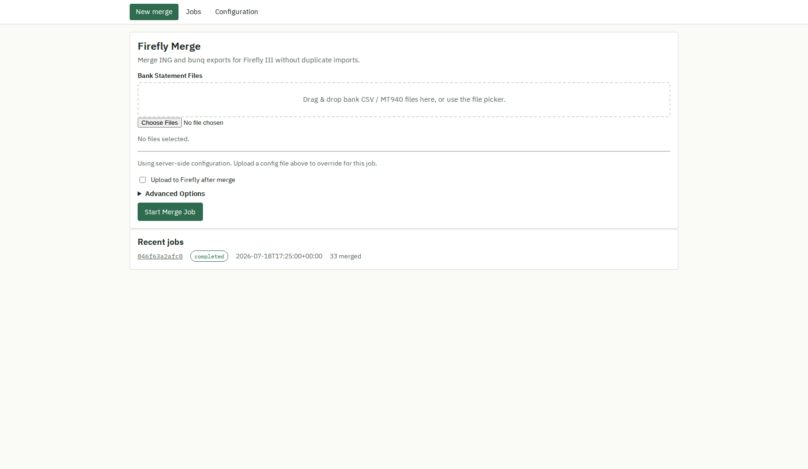
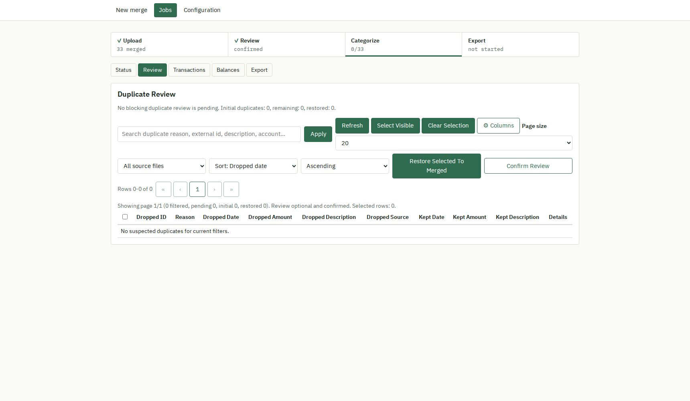
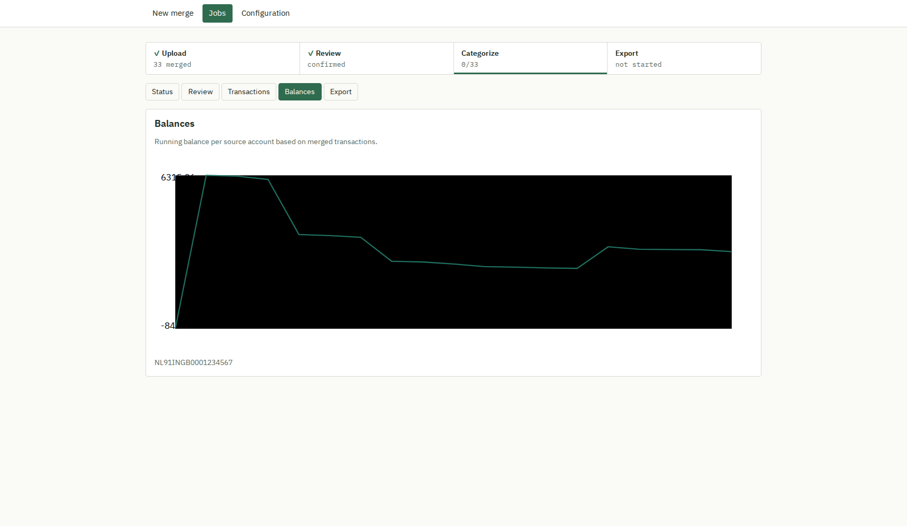
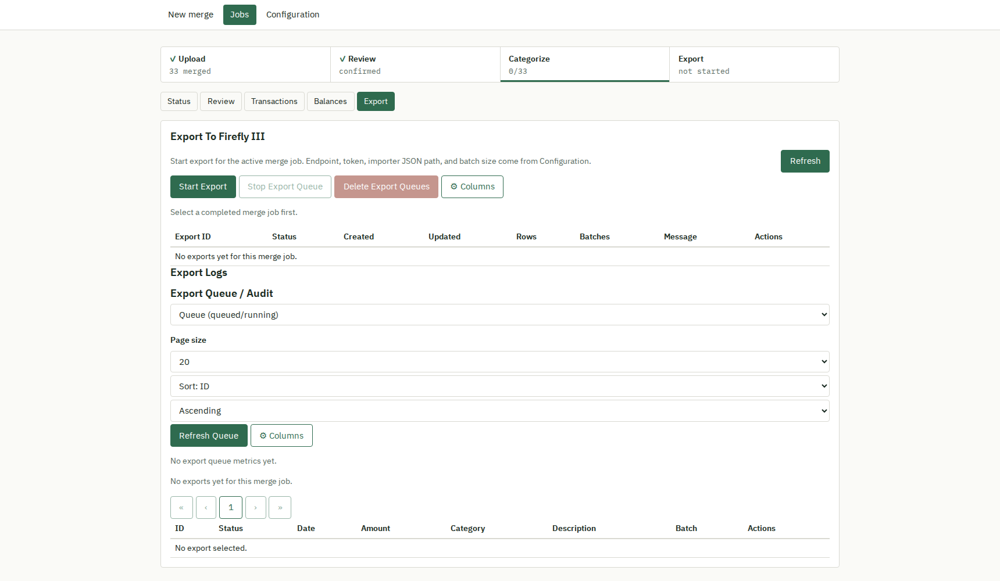
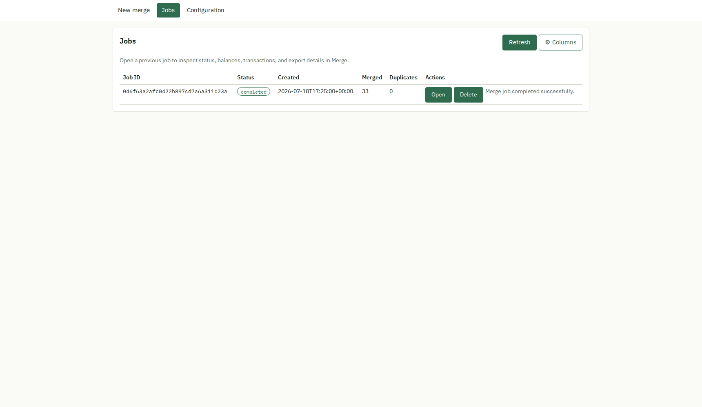
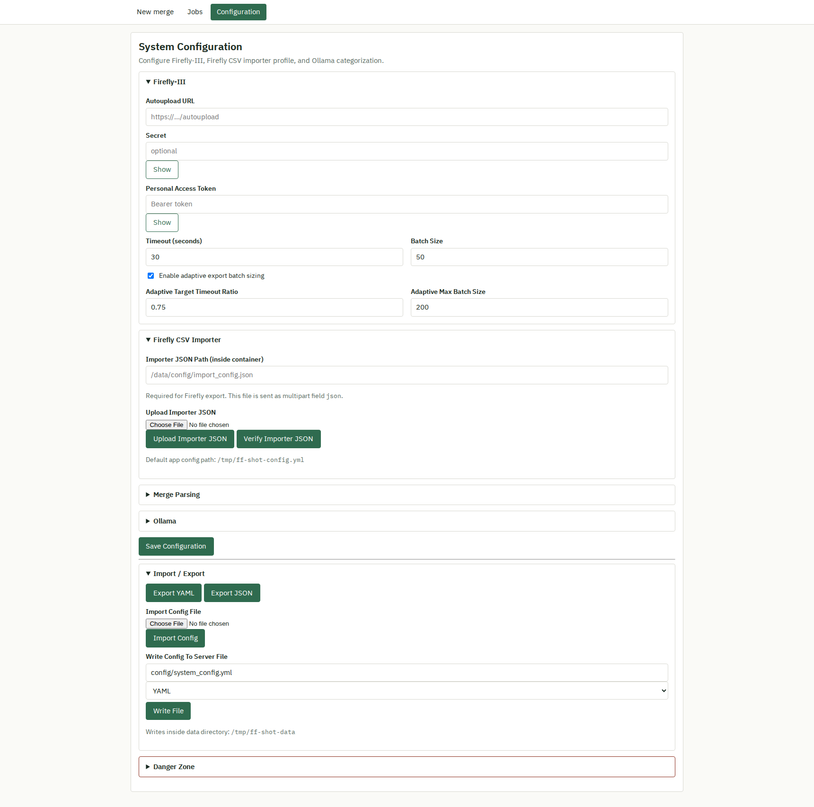

# Firefly Merge Web Tool

Web-based tool to merge bank exports (CSV/MT940), review duplicates, categorize transactions with Ollama, and export to Firefly III without duplicate imports.

## Pages

The app is a small multi-page site (no client-side router). The topbar links to three top-level pages, plus a per-job area:

| Page | URL | Purpose |
|------|-----|---------|
| New merge | `/` | Upload bank files and start a merge job; shows a strip of recent jobs |
| Jobs | `/history` | Every job ever run, with status, merged/duplicate counts, and a link to open each one |
| Configuration | `/config` | Firefly-III connection, CSV importer profile, merge parsing, and Ollama settings |
| Job status | `/jobs/{id}` | Merge log, stats, and generated artifacts for one job |
| Review | `/jobs/{id}/review` | Duplicate review table (confirm or restore dropped rows) |
| Transactions | `/jobs/{id}/transactions` | Categorization table, Ollama batch actions, categorization audit log |
| Balances | `/jobs/{id}/balances` | Running balance chart per source account |
| Export | `/jobs/{id}/export` | Push to Firefly III, export queue/audit log |

A topbar badge (⚙ N running) lights up whenever an Ollama categorization batch or Firefly export is active in the background, and links straight to that job's page.

## Workflow

Each job moves through four stages, shown as a pipeline rail at the top of every job page:

```
Upload → Review → Categorize → Export
```

The rail marks each stage done, current, or locked (later stages lock until the one before them finishes), so you always know what's next and can't jump ahead of yourself.

### Upload

Upload one or more bank statement files (CSV or MT940) from the New merge page. The tool merges them, deduplicates within the job, and starts a background job. The New merge page also lists your recent jobs so you can jump back into one without visiting Jobs.



The job status page shows the merge log, row counts, and generated artifacts (merged CSV, reconciliation CSV) as the job runs:


### Review

Transactions the merge flagged as possible duplicates are listed for manual review. Restore any that were dropped in error, then confirm the review to unlock categorization.



### Categorize

Transactions are listed in a sortable, filterable, paginated table. Edit categories inline, or send selected/all rows to Ollama for AI-assisted categorization — writes are merge-safe, so a batch never clobbers categories set elsewhere in the meantime. A categorization audit log records what changed. Optionally auto-export newly categorized batches to Firefly III as they complete.


Every table on the site (Transactions, Review, Jobs, Export) supports column show/hide via the ⚙ Columns button and click-to-sort column headers.

Balances gives you a running-balance chart per source account to sanity-check the merged data before exporting:



### Export

Push transactions to Firefly III. Export runs once per job as a background queue with per-row status; failed rows can be retried individually from the export queue/audit table.



---

## Jobs

Every job you've run is listed on the Jobs page (`/history`) with sortable columns and a link to open its status page.



## Configuration

The Configuration page (`/config`) holds Firefly-III connection details, the CSV importer profile, merge-parsing defaults (own accounts, aliases, savings accounts), and Ollama settings. Secret fields (Firefly secret, personal access token) render as password inputs by default; click "Show" next to a field to reveal it in plain text.



---

## Quick start (Docker Compose)

1. Create a host config directory **outside this repo** (recommended):

```bash
mkdir -p ../firefly-merge-config
cp config.example.yml ../firefly-merge-config/config.yml
cp import_config.example.json ../firefly-merge-config/import_config.json
```

2. Start the app:

```bash
docker compose up --build
```

3. Open:

- App: `http://localhost:8080`
- Configuration: `http://localhost:8080/config`

## Persistent storage and filesystem mapping

`docker-compose.yml` uses two bind mounts:

- `${FIREFLY_MERGE_DATA_DIR:-./data}:/data`
  - job state, queues, sqlite db, generated artifacts
- `${FIREFLY_MERGE_CONFIG_DIR:-../firefly-merge-config}:/config`
  - your runtime config files (`config.yml`, `import_config.json`)

The app reads config from:

- `APP_CONFIG_PATH=/config/config.yml`

This setup keeps secrets and account config outside the git repo by default.

## Optional environment overrides

In `docker-compose.yml`:

- `FIREFLY_URL`
- `FIREFLY_SECRET`
- `FIREFLY_TOKEN`
- `FIREFLY_JSON`
- `FIREFLY_TIMEOUT`
- `FIREFLY_BATCH_SIZE`

## Local (non-docker) run

```bash
pip install -r requirements.txt
FIREFLY_WEB_DATA_DIR=./data APP_CONFIG_PATH=./config.yml \
  python -m uvicorn firefly_web.app:app --host 127.0.0.1 --port 8080
```

## Test data

Sample bank exports for development and testing are in `test_data/`:

| File | Format | Transactions | Account |
|------|--------|-------------|---------|
| `ing_export_jan2025.csv` | ING CSV | 16 | NL91INGB0001234567 |
| `bunq_export_jan2025.csv` | bunq CSV | 17 | NL91INGB0001234567 |

Both files cover the same account for January 2025, with intentional overlaps to produce duplicate candidates during a merge. Upload both files together on the New merge page to see the full workflow.

## Testing

GitHub Actions (`.github/workflows/ci.yml`) runs on every push and pull request:

```bash
python -m pytest tests/ -q      # unit/integration tests
python tools/test_e2e.py        # requests-based flow test: upload -> merge -> review -> categorize -> export
```

Run the same commands locally before opening a PR. For a visual sweep of every page (desktop + mobile), start a dev server and run:

```bash
python tools/capture_ui.py --base-url http://localhost:PORT --job-id <id> --out-dir output_check/ui
```

`--job-id` is optional; pass it (from a completed job) to also capture the `/jobs/{id}/...` pages. `capture_ui.py` needs Playwright — see `WEBAPP.md`.

## Security / repository hygiene

This repo intentionally ignores local sensitive files:

- `config.yml`
- `import_config.json`
- `.env*`
- `data/`, `input/`, `output/`, `balances/`, `output_check/`

Use the provided `config.example.yml` and `import_config.example.json` as templates.
