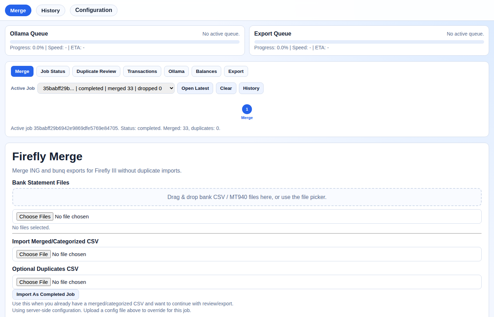
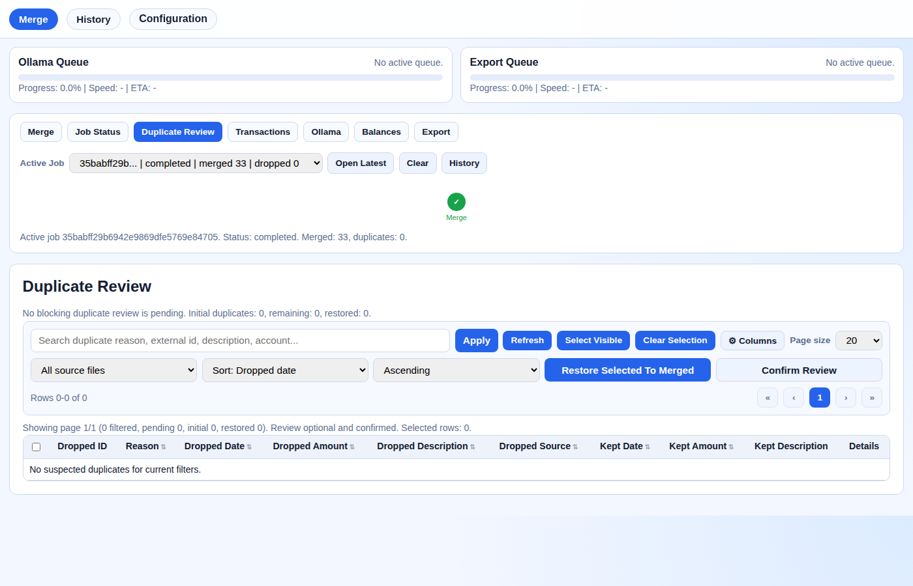
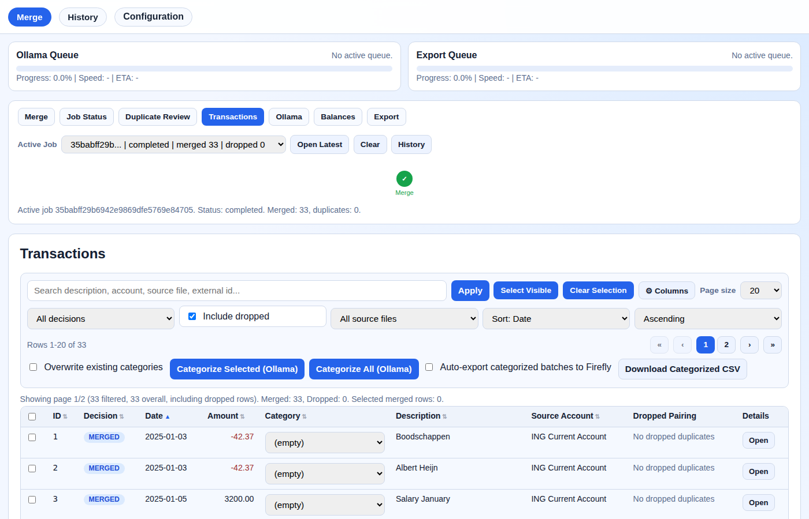
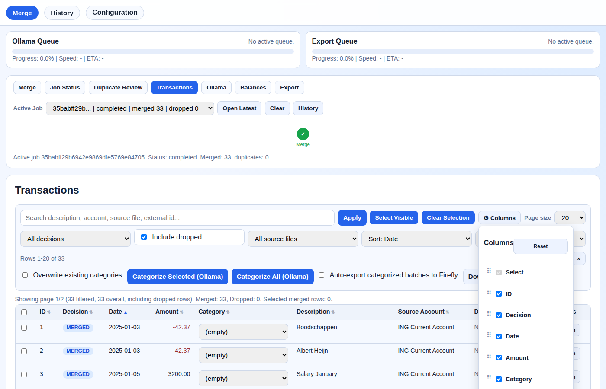
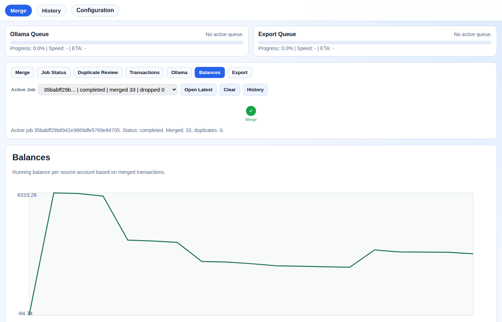
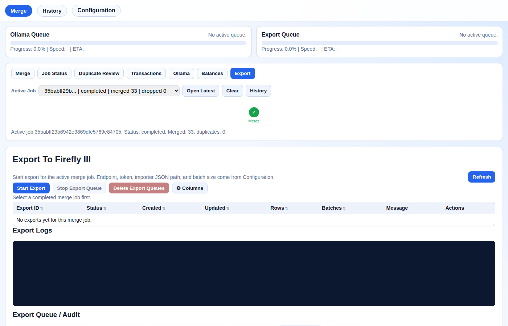
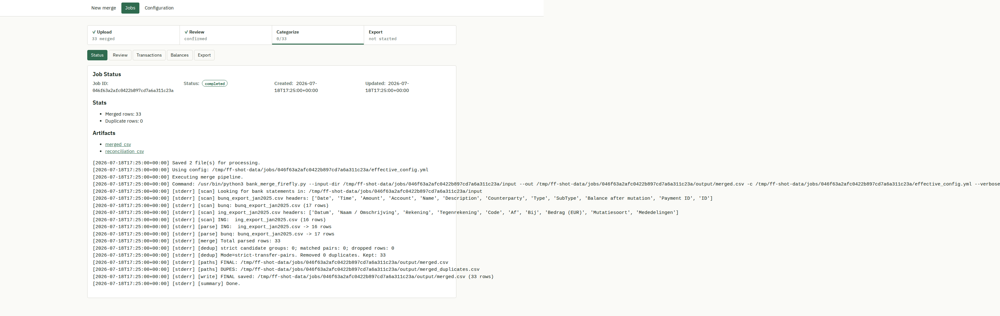
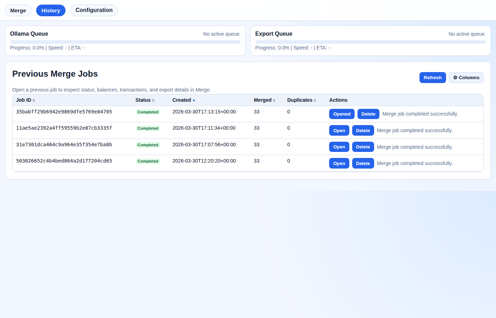

# Firefly Merge Web Tool

Web-based tool to merge bank exports (CSV/MT940), review duplicates, categorize transactions with Ollama, and export to Firefly III without duplicate imports.

## Workflow

The tool guides you through five sequential steps:

```
Merge → Review → Categorise → Verify → Export
```

A visual stepper at the top of the page shows your current position and locks forward steps until earlier ones are complete.

### Step 1 — Merge

Upload one or more bank statement files (CSV or MT940). The tool merges them, deduplicates across files, and creates a job.



### Step 2 — Review duplicates

Transactions identified as potential duplicates are shown side-by-side for manual review. You must confirm or dismiss each pair before proceeding.




### Step 3 — Categorise

Transactions are listed in a sortable, filterable table. Categories can be edited inline. Optionally, send batches to Ollama for AI-assisted categorization.



**Column management** — click ⚙ Columns to toggle visibility, drag to reorder, or sort by any column header:



**Sort by amount** — click any column header to sort ascending/descending:


### Step 4 — Verify

Review account balances to confirm the merged data looks correct before exporting.



### Step 5 — Export

Push transactions to Firefly III. Exports run in the background with per-event status. Failed rows can be retried individually.



---

## Job status

The Job Status panel shows the merge log, transaction counts, and detected duplicates for the active job.



## History

All previous jobs are listed in the History tab with sortable columns and one-click reload.



## Workflow stepper

The stepper updates automatically as you progress through the workflow, marking completed steps in green and locking unavailable steps.


---

## Quick start (Docker Compose)

1. Create a host config directory **outside this repo** (recommended):

```bash
mkdir -p ../firefly-merge-config
cp config.example.yml ../firefly-merge-config/config.yml
cp import_config.example.json ../firefly-merge-config/import_config.json
```

2. Start the app:

```bash
docker compose up --build
```

3. Open:

- App: `http://localhost:8080`
- Configuration: `http://localhost:8080/config`

## Persistent storage and filesystem mapping

`docker-compose.yml` uses two bind mounts:

- `${FIREFLY_MERGE_DATA_DIR:-./data}:/data`
  - job state, queues, sqlite db, generated artifacts
- `${FIREFLY_MERGE_CONFIG_DIR:-../firefly-merge-config}:/config`
  - your runtime config files (`config.yml`, `import_config.json`)

The app reads config from:

- `APP_CONFIG_PATH=/config/config.yml`

This setup keeps secrets and account config outside the git repo by default.

## Optional environment overrides

In `docker-compose.yml`:

- `FIREFLY_URL`
- `FIREFLY_SECRET`
- `FIREFLY_TOKEN`
- `FIREFLY_JSON`
- `FIREFLY_TIMEOUT`
- `FIREFLY_BATCH_SIZE`

## Local (non-docker) run

```bash
pip install -r requirements.txt
FIREFLY_WEB_DATA_DIR=./data APP_CONFIG_PATH=./config.yml \
  python -m uvicorn firefly_web.app:app --host 127.0.0.1 --port 8080
```

## Test data

Sample bank exports for development and testing are in `test_data/`:

| File | Format | Transactions | Account |
|------|--------|-------------|---------|
| `ing_export_jan2025.csv` | ING CSV | 16 | NL91INGB0001234567 |
| `bunq_export_jan2025.csv` | bunq CSV | 17 | NL91INGB0001234567 |

Both files cover the same account for January 2025, with intentional overlaps to produce duplicate candidates during a merge. Upload both files together in the Merge step to see the full workflow.

## Security / repository hygiene

This repo intentionally ignores local sensitive files:

- `config.yml`
- `import_config.json`
- `.env*`
- `data/`, `input/`, `output/`, `balances/`, `output_check/`

Use the provided `config.example.yml` and `import_config.example.json` as templates.
